# Common Hydrology Features (CHyF)   Volume 2: Compliant Source Hydrography   and DEM Specification,  Version 1.0

**Natural Resources Canada (NRCan)**,
**Canada Centre for Mapping and Earth Observation (CCMEO)**

Date: 2019 May 16

Copyright and Licence Notice
- Copyright © 2019 Government of Canada
- This document falls under the [Open Government Licence - Canada, Version 2.0](https://open.canada.ca/en/open-government-licence-canada)

Authorship

- NRCan/CCMEO
  - [mark.sondheim@canada.ca](mailto:mark.sondheim@canada.ca)
  - [mark.lague@canada.ca](mailto:mark.lague@canada.ca)

- Refractions Research, Inc.
  - [egouge@refractions.net](mailto:egouge@refractions.net)
  - [chodgson@refractions.net](mailto:chodgson@refractions.net)

## Overview

CHyF developments are under the auspices of the Canada Centre for
Mapping and Earth Observation, Natural Resources Canada, with support
from the National Hydrological Services, Environment and Climate Change
Canada and the Canadian Society for Hydrological Sciences. The interest
and advice from the United States Geological Survey and the
International Joint Commission are gratefully acknowledged.

This document is the second in the [CHyF documentation series](./index.md#CHyF-documentation-series):

- Volume 1: [CHyF Conceptual Model](./chyfConceptualModel.md)

- Volume 2: CHyF Compliant Source Data Hydrography and DEM Specification

- Volume 3: CHyF Data for CHyF Services Specification

- Volume 4: Data Processing and Validation Tools

- Volume 5: Web Services and Applications

The position of this document within the scope of the CHyF series is
shown in Figure 1 below.

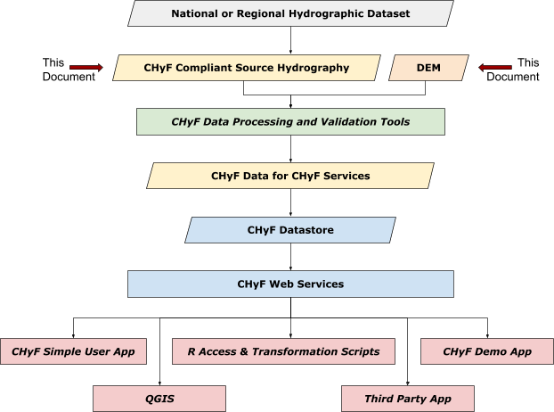

_Figure 1: Overview of CHyF data and services_

The hydrographic data originates with a national or regional dataset
that adheres to a different model from that used with CHyF. In most
cases, elements from such datasets can be mapped into the CHyF model
using tabular crosswalks or other schema transformation techniques. More
involved approaches may be required with some input datasets, depending
upon how structurally or semantically different the respective models
are from what is described below..

The CHyF compliant source hydrographic data consists of the following
three feature types, which are explained in more detail in sections 2
and 3.

- Reach flowpaths (mandatory), a type of elementary flowpath, representing waterbodies with linear geometry, such as single-line rivers and canals

- Skeleton flowpaths (optional), a type of elementary flowpath, representing flow through polygonal waterbodies, including lakes, double-line rivers, and other waterbodies with polygonal geometry

- Water catchments (mandatory), a type of elementary catchment, representing polygonal waterbodies, including lakes, double-line rivers, and other waterbodies with polygonal geometry

_Figure 2: Source features mapped onto CHyF flowpaths and catchments_

Although CHyF recognizes a rich set of features, including rivers,
lakes, and many other feature types, the intention here with the source
hydrographic data is to recast data from national or regional
hydrographic datasets into CHyF features. The reach flowpaths and water
catchments are mandatory inputs. If skeleton flowpaths are not
available, they will be generated using the CHyF Processing Tools. Other
analytical feature types, such as bank flowpaths and reach, bank and
empty catchments are not provided at this stage.

The source datasets may contain additional attributes that are not used
by the Tools or the CHyF web services. These attributes may include
identifiers that are used in a database for management purposes. In the
interest of conserving space and increasing performance, they will be
stripped out at a later stage when a CHyF datastore is created for use
by CHyF services.

## The CHyF Model

This section gives a brief introduction to CHyF. The more detailed
version is available in Volume 1 of this series, *CHyF Conceptual
Model*.

In early 2018 the Open Geospatial Consortium published Version 1.0 of
*OGC® WaterML 2: Part 3 - Surface Hydrology Features (HY\_Features) -
Conceptual Model*. CHyF refines and extends HY\_Features. In the
interest of high performance and low maintenance, CHyF borrows heavily
from graph theory, a branch of mathematics that is used in routing and
other problem spaces that can be envisioned as a large set of
connections. CHyF also borrows from basic Geographic Information System
concepts, including surface coverages and planar topology. CHyF is
designed to be fully operational, suitable for both small and large
volumes of data.

Of particular interest is the emphasis on fast navigation through river
and catchment (drainage area) networks, without depending on immutable
identifiers that must be maintained through conflation and other
techniques over the long term. CHyF services, described in Volume 5 of
this series, are designed to work over the web, supporting various kinds
of hydrological queries associated with upstream/downstream
relationships and pour point analysis, using graph theory and geospatial
analysis in the background.

Three high level concepts of relevance here are: waterbodies,
catchments, and flowpaths. Waterbodies, such as rivers and lakes, are
directly captured as part of topographic mapping or water inventory
activities. Depending upon type, size, and scale, they may be
represented geometrically as either linestrings or polygons. Techniques
for data capture may involve photogrammetry, high resolution imagery,
lidar, machine learning, and traditional GIS data collection.

A catchment is a drainage area. Other equivalent terms include basin and
watershed. Each waterbody has an associated catchment, but as discussed
later, catchments exist that do not contain a waterbody. Catchments can
be defined by raster or vector analysis, although with CHyF, vector
processing is used to guarantee that resulting topological relationships
are correct. Flowpaths are synthetic linear features through waterbodies
that indicate the flow of water. Flowpaths and catchments can be
generated by software, given waterbodies data and (in the case of
catchments) an appropriate Digital Elevation Model (DEM). As well,
flowpaths and catchments form networks that can be treated as a single
mathematical graph, suitable for network traversal and other kinds of
analysis.

Table 1 below summarizes the basic ideas behind waterbodies, catchments,
and flowpaths. Some of the terms in the second column will become clear
once Figure 3 is examined.

|High Level Concept         |Implementable Features       |Description                                  |
|---------------------------|-----------------------------|---------------------------------------------|
|Waterbody                  |river, canal (and ditch), estuary, nearshore zone, lake, ocean, buried/constructed infrastructure (e.g. storm drain or flow through a dam), ocean - all of which are types of waterbodies    |Most waterbodies are observable as surface hydrological features, others may be inferred by vegetation or topography, and some may be elements of buried/constructed infrastructure. A distinction is made between waterbodies with linear geometry and waterbodies with polygonal geometry.                                      |
|Elementary Catchment       |reach catchments, bank catchment, empty catchments, water catchments - all of which are types of elementary catchments; larger catchments are collections of elementary catchments     |Elementary catchments form a coverage covering the entire terrain. Every reach catchment drains into a waterbody that it contains. A bank catchment does not contain a waterbody but is adjacent to one. An empty catchments does not contain and is not adjacent to a waterbody. A water catchment is equivalent to a polygonal waterbody or to a subdivision of such a waterbody.   |
|Elementary Flowpath        |reach flowpath, skeleton flowpath, bank flowpaths - all of which are types of elementary flowpaths; longer flowpaths are sequences of elementary flowpaths following a single, connected path   |Flowpaths exist to support analysis. Reach flowpaths correspond to sections of waterbodies with linear geometry. Skeleton and bank flowpaths exist in waterbodies with polygonal geometry. Skeleton flowpaths form a skeleton that connects inflows and outflows to a central spine. Bank flowpaths connect bank catchments to the skeleton.|

_Table 1: Some high level CHyF feature types_

Figure 3 below shows two lakes, some rivers, and areas draining into the
lakes and rivers.

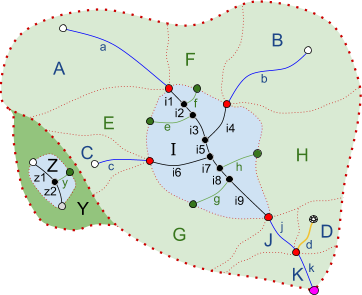

_Figure 3: Waterbodies, catchments and flowpaths_

Assume that the lakes are named Big Lake and Little Lake. The heavy
dotted boundary around the light green area defines one catchment and
the heavy dotted boundary around the dark green area defines a second
catchment. All of the dotted lines taken together define 13 elementary
catchments that cover both land and water. A, B, C, D, J and K are
called reach catchments as they contain a stream reach. E, F, G, H and Y
are bank catchments; they do not contain a stream. Instead water flows
through their respective banks and/or as subsurface flow directly into
an adjacent waterbody. Big Lake and Little Lake are redefined as water
catchments I and Z, respectively. Empty catchments, not shown, are
depressions in the land that neither contain waterbodies nor are
adjacent to waterbodies.

Flowpaths a, b, c, d, j and k were derived from single-line rivers and
are equivalent to them. All but d are assumed to be directly observable;
d originates at a spring and is inferred from the topography or
vegetation. The black skeletal elements in the lakes – i1 through i9,
z1, z2 – are skeleton flowpaths. As shown, they have a many-to-one
relationship with each lake. The green skeletal elements – e, f, g, h, y
– are referred to as bank flowpaths, as they connect bank catchments to
the main skeletons.

The skeleton flowpaths (i1 through i9, z1, z2) form lake skeletons. Each
such skeleton appears as a a spine through its associated lake, with
connecting skeleton flowpaths defined to each inflowing single-line or
double-line river. These skeleton flowpaths may connect directly to the
central spine or may join beforehand, making local dendritic structures
and loops. So long as the flow directions are such that water following
the flowpaths can never flow back to the same location (forming a
cycle), all such patterns are allowed.

Figure 3 also shows a slightly larger pink point at the very bottom of
catchment K. This indicates that the point is a working limit of the
data being examined. The working limits consist of a set of points
(represented as a single multipoint) that shows where flowpaths
intersect the actual or implied boundary of the area of data
availability or the area of interest. In Figure 3 the working limits is
defined by a single point which happens to be the outflow point on the
flowpath network of the watershed.

The CHyF model requires all of the components described above. However,
an agency may have only some or none of the flowpaths and catchments
defined. A companion set of software, the CHyF Data Processing Tools, is
available that can help create what is missing. Similarly, if the
working limits are not available, a polygon defining the area of
interest can be processed with the flowpath data to generate the
required multipoint and the elementary flowpaths that touch the
boundary.

The feature types, their attributes, and their topological constraints
are described in section 3.

## Source Hydrography Modelled in CHyF as Flowpaths and Catchments: Physical Implementation

CHyF includes a rich model describing a wide range of hydrologic and
hydrologically related features. CHyF services however emphasize
analysis and consequently flowpaths and catchments are of particular
interest. This section provides a physical description of the source
data modelled as a CHyF compliant datastore containing flowpaths and
catchments.

### Dataset Description

All data must meet the requirements described below.

#### Projection and Precision

Data can be provided in any projection with a valid EPSG code; the
projection information must be provided with the data. No particular
precision model for the input data is assumed. The data will be
converted to EPSG:4326 with 7 digits of precision past the decimal
point. Some form of snap rounding may be applied to the coordinate
values and in some cases individual vertices may be removed or added. If
the data is converted back to the original coordinate space, the
coordinate values may differ and the number of vertices on any given
geometry may differ as well.

#### Format

All data will be in vector form and will be provided as PostGIS tables
or as a single GeoPackage file with a .gpkg extension. If data is
available only in the shapefile format, it can be converted to a
GeoPackage quite easily using QGIS, GeoTools, or other open source
options. A number of geospatial commercial offerings also support such
conversion. This move away from shapefiles is justified on the basis of
the limitations inherent in the format.

#### Input Datastore Structure and Names

The names for the linear features and polygonal waterbodies data must be
as follows for the CHyF compliant source data hydrography.

|Feature Type         |Structure       |Name             |Description                                  |
|---------------------|----------------|-----------------|---------------------------------------------|
|Elementary Flowpath  |PostGIS Table or GeoPackage Layer |EFlowpaths      |Reach flowpaths and optionally skeleton flowpaths, both of which are types of elementary flowpaths, are included. Either the National or Regional Hydrographic Dataset has reach flowpaths already defined, or single-line waterbodies are converted to reach flowpaths as specified in this document. Skeleton flowpaths may be available, in which case they can be provided as well, so long as they can be described as defined here. Elementary flowpaths are represented geometrically as linestrings, meeting specific topological constraints.                                      |
|Elementary Catchment |PostGIS Table or GeoPackage Layer |ECatchments     |Included here are lakes, double-line streams, estuaries and other hydro features represented geometrically as polygons, and redefined in whole or in part as water catchments. Water catchments are the only type of elementary catchment provided here. Elementary catchments are represented geometrically as polygons, meeting specific topological constraints.                                      |
|Working Limits       |PostGIS Table or GeoPackage Layer |WorkingLimits   |The working limits are represented by a multipoint, where each constituent point occurs at the intersection of a flowpath with a polygon encompassing the area of interest.    |

#### Connectivity to Other Data

Users who wish to provide data that connects with existing data are
responsible for ensuring correct connectivity. Alternatively, they may
work with administrators to determine shared or adjoining boundary data.

#### Metadata

This release does not support metadata. However, it will be supported in
a future release.

#### Linked Data

CHyF is intended to work with Linked Open Data (LOD). This will likely
be implemented at the level of large catchments (e.g., equivalent to HUC
12 watersheds in the US or areas approximating the subsubdrainages in
the Drainage Area Framework in Canada defined by Environment and Climate
Change Canada). Each of these catchments represents the drainage area of
a named river or a portion of such an area. The details regarding how
LOD will be supported will be included in a future release.

#### Very Large Datasets

CHyF is intended to be practical with small to very large datasets,
including those of potentially a continental scale. Different approaches
may be viable and may impact how input data is handled or what ancillary
data may be required. More details will be available in a future
release.

### Elementary Flowpath Description

An elementary flowpath is a derived linear feature representing the path
of water from one hydro node (e.g. confluence or headwater point) to
another. Three types of elementary flowpaths exist in CHyF, reach
flowpaths, skeleton flowpaths, and bank flowpaths. Reach flowpaths must
be provided; skeleton flowpaths are optional. Bank flowpaths are not
provided, as they are generated later, along with the skeleton flowpaths
if they are not available with the source hydrology features.

All elementary flowpaths are represented geometrically as a linestring,
with the order of the vertices always in a downstream direction. Five
attributes apply to the source hydrology data, as noted in the table
below; however, subtype is left blank for elementary flowpaths of type
skeleton (type = 2).

If skeleton flowpaths are given, isolated lakes with no visible inflows
and outflows, and headwater lakes with one or more outflows and no
visible inflows, must each contain one or more skeleton flowpaths. If
CHyF compliant skeleton flowpaths exist in other polygonal waterbodies
but not in these, then CHyF Data Processing and Validation Tools may be
used against the isolated lakes and headwater lakes to add the missing
skeleton flowpaths.

#### Elementary Flowpath Attributes

Five attributes are listed below.

|Attribute Name    |Full Name       |Required         |Data Type                                    |
|------------------|----------------|-----------------|---------------------------------------------|
|ef_type           |EF Type         |Yes              |Integer                                      |
|ef_subtype        |EF Subtype      |No               |Integer                                      |
|rank              |Rank            |No               |Integer                                      |
|common_name       |Common Name     |No               |String                                       |
|national_name_id  |National Name ID|No               |String (UUID)                                |

##### EF Type

Three types of flowpaths exist. However, in this dataset all flowpaths
are reach flowpaths or skeleton flowpaths, coded with a value of 1 or 3,
respectively, as per the table below.

|Value    |Name       |Description                                                                  |
|---------|-----------|-----------------------------------------------------------------------------|
|1        |Reach   |An elementary flowpath representing, in whole or in part, a linear waterbody. In the NHN these are referred to as Water Linear Flows with a flow qualifier of Observed or Constructed.                                      |
|3        |Skeleton   |An elementary flowpath that is part of a virtual path located in a polygonal waterbody. Such a waterbody may have one or many associated skeleton flowpaths, depending upon the number of inflows and outflows, and the way the skeleton network is formed. In the NHN these are referred to as Water Linear Flows with a flow qualifier of Inferred.                  |

##### EF Subtype

An additional description of the flowpath type, that refers only to reach flowpaths. Currently the subtype is not required by the CHyF services, but it may be of interest to retain if it exists in the original data.

|Value    |Name       |Description                                                                  |
|---------|-----------|-----------------------------------------------------------------------------|
|10       |Observed   |Reach flowpath subtype representing an observed stream flowpath. It is equivalent to _Observed_ for FLOW_QUALIFIER for a Water Linear Flow in the NHN                                                                      |
|20       |Inferred   |Reach flowpath subtype representing a flowpath that appears to traverse the land but was not visible when mapped. It is equivalent to a _Constructed_ for FLOW_QUALIFIER for a Water Linear Flow in the NHN, but excludes flows through dams    |
|30       |Buried/constructed Infrastructure|Reach flowpath subtype representing a subsurface flow contained in a conduit, such as a storm drain, a sanitary sewer, a flow through a dam or an industrial complex.In the case of a flow through a dam, it is equivalent to a _Constructed_ for FLOW_QUALIFIER for a Water Linear Flow in the NHN|
|99       |Unknown    |Unknown, impossible to determine, or unrelated to the other existing subtypes. It is equivalent to _Not Identified_ for FLOW_QUALIFIER for a Water Linear Flow in the NHN   |

##### Rank

This refers to whether the flowpath is considered as part of a primary
or secondary flow. Flowpaths with an unspecified rank may have the rank
determined through later processing using the CHyF Data Processing
Tools.

|Value    |Name       |Description                                                                  |
|---------|-----------|-----------------------------------------------------------------------------|
|1        |Primary     |If the flowpath is considered to contain the principal water flow. It is equivalent to LEVEL_PRIORITY set to Primary for a Water Linear Flow in the NHN                                                                  |
|2        |Secondary  |If the flowpath is considered a braid, a distributary or other flowpath encountered at a point of diversion, traversing in a downstream direction, and if it is considered as of less importance than the primary flowpath. It is equivalent to LEVEL_PRIORITY set to Secondary for a Water Linear Flow in the NHN                                                        |
|99       |Unspecified|No indication is given as to whether the flowpath is considered a primary or secondary. Unspecified will typically be treated as Primary for data processing and analysis purposes.  It is equivalent to Not Identified for LEVEL_PRIORITY for a Water Linear Flow in the NHN.                                                                                         |

##### Common Name

This is the name used most commonly in the jurisdiction in which the
data resides. It is used for analytical purposes and may differ from a
name presented to a user, which may for example be in the language
preferred by the user.

##### National Name ID

Given if the name appears in a national toponymic database. The National
Name ID in Canada is taken from the Canadian Geographical Names
Database.

### Elementary Catchment Description

The term elementary catchment refers to an areal feature with polygonal
geometry that defines a fundamental drainage area. CHyF recognizes four
different types of elementary catchments, with water catchment being the
only one that is relevant here.

Water catchments all have polygonal geometry, and may or may not contain
holes. The orientation of any inner boundaries (inner rings) is opposite
of the outer boundary (outer ring), which may be oriented in either a
clockwise (CW) or counter-clockwise (CCW) direction. The geometry must
meet certain topology constraints, as described in section 3.4.
Attributes are given below.

#### Elementary Catchment Attributes

Three attributes may be provided for the source data.

|Attribute Name    |Full Name       |Required         |Data Type                                    |
|------------------|----------------|-----------------|---------------------------------------------|
|ec_type           |EC Type         |Yes              |Integer                                      |
|ec_subtype        |EC Subtype      |No               |Integer                                      |
|common_name       |Common Name     |No               |String                                       |
|national_name_id  |National Name ID|No               |String (UUID)                                |

##### EC Type

In this dataset all catchments are water catchments, coded with a value
of 4.

|Value    |Name       |Description                                                                  |
|---------|-----------|-----------------------------------------------------------------------------|
|4        |Water      |A catchment with polygonal geometry representing (i) watercourses such as rivers that are sufficiently large to have been mapped with polygonal geometry, or (ii), static or tidal waterbodies such as lakes, estuaries, nearshore zones, and the ocean      |

##### EC Subtype

An additional description of the water catchment type. Currently not
required by the CHyF services, but may be in the future.

|Value    |Name       |Description                                                                  |
|---------|-----------|-----------------------------------------------------------------------------|
|10       |Lake       |A body of surface water                                                      |
|11       |Great Lake |One of the Great Lakes of North America or other very large lakes            |
|12       |Wastewater Pond|A pond or lagoon designed to contain wastewater for treatment            |
|20       |Estuary    |A body of surface water at a freshwater - ocean water interface, typically characterized by tidal waters|
|30       |Nearshore Zone|The zone extending from the edge of a large waterbody (freshwater or the ocean), based on an arbitrary distance, bathymetry or littoral characteristics|
|40       |River      |A body of surface water characterized by its flow                            |
|41       |Canal      |A body of surface water, participating in a hydrographic network, special due to its artificial origin. Ditches are also included here|
|50       |Buried Infrastructure|A body of subsurface flow contained in a conduit, such as a storm drain, a sanitary sewer, a flow through a dam or an industrial complex|
|90       |Ocean      |A large body of saline water that composes much of the earth’s hydrosphere and that is not situated inland|
|99       |Unknown    |The subtype is not know or does not correspond to one of the known types listed above|

##### Common Name

The Common Name may correspond to the original waterbody feature from
which the catchment was derived. It may differ from a name presented to
a user, which may for example be in the language preferred by the user.

##### National Name ID

Given if the name appears in a national toponymic database.

### Working Limits Description

The boundary of a watershed, the boundary of the limits of available
data, or in general the boundary of an area of interest all specify an
area that potentially is relevant to a request or query. This is a
useful concept that is leveraged by some of the CHyF software
components.

Of particular interest are the locations where the boundary of the area
of interest intersects a flowpath. For each such flowpath, the first
vertex or the last vertex must fall exactly on the boundary and be
coincident with a vertex on the boundary. These points of intersections
define the working limits in a network context. Provision of these
points clarifies whether a dangling flowpath endpoint is a true
headwater point or sink point, or instead is an artifact of processing.

The working limits are treated as a geospatial feature with its geometry
defined as a multipoint.

#### Working Limits Attributes

No attributes are applied to the working limits feature.

## Topology Rules

The reach flowpaths, skeleton flowpaths, water catchments and working
limits must meet a set of topology rules. These are as follows.

Some of the material below references the Dimensionally Extended
nine-Intersection Model (DE-9IM) model that describes the relationship
between two geometries. More details on this model can be found [here](https://en.wikipedia.org/wiki/DE-9IM "Dimensionally Extended nine-Intersection Model").

### Elementary Flowpaths

The elementary flowpaths of interest here are all reach flowpaths or
skeleton flowpaths.

__EF Rule 1__: Each elementary flowpath must
be represented geometrically by a valid linestring, following the OGC
simple features specification. Multilinestrings are not supported.

__EF Rule 2__: The order of vertices for each
elementary flowpath must be in a downstream direction.

|Correct                                                           |Incorrect                                                             |
|------------------------------------------------------------------|----------------------------------------------------------------------|
|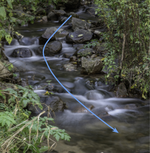            |            |

_Figure 4: Order of vertices in flowpath matches flow direction_

__EF Rule 3__: Elementary flowpaths must form
a directed, acyclic network, that need not be fully connected. Loops are
not allowed where water at a given location in the network can flow back
to the same location.

|Correct                                                           |Incorrect                                                             |
|------------------------------------------------------------------|----------------------------------------------------------------------|
|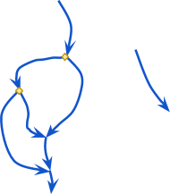|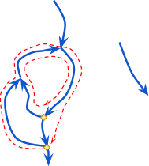|

_Figure 5: The elementary flowpaths form a directed acyclic network (gold diamonds are points of divergence; two illegal loops on right)_

__EF Rule 4__: Where a flowpath meets another
flowpath, the point of intersection is always at an endpoint for each
flowpath. That is, the flowpaths can touch one another, but they cannot
cross one another. With reach and skeleton flowpaths, touching may be at
one endpoint, or at both endpoints in the case of a loop (i.e. braid).

|Correct    |Correct  |Incorrect|
|-----------|---------|---------|
|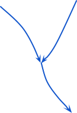|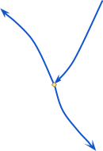||

_Figure 6: Flowpath touching another flowpath_

This rule can be stated more formally as follows:

|Rule       |Flowpath Type (a)|Flowpath Type (b)|Description          |Valid DE-9IM          |
|-----------|-----------------|-----------------|---------------------|----------------------|
|EF Rule 4  |Any              |Any              |Disjoint OR Touch    |FF\*FF\*\*\*\* OR FF\*F0\*\*\*\* |

\*The exception to this rule is with reach flowpaths of subtype
*Buried/Constructed Infrastructure,* coded as subtype 30. Buried pipes
may cross one another as well as rivers and canals, when evaluated in
2D.

__EF Rule 5__: At any node with multiple
outflows, i.e., at a point of divergence, one and only one outflow must
be a primary flowpath.

(This rule does not apply if the source data does not have the attribute
*rank* populated.)

|Correct    |Incorrect|Incorrect|
|-----------|---------|---------|
|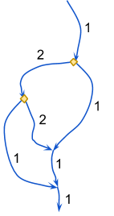|||

_Figure 7: Primary (1) and secondary (2) elementary flowpath designations_

__EF Rule 6__: With reach and skeleton
flowpaths, touching may be at one endpoint, or at both endpoints.

|Rule       |Flowpath Type (a)|Flowpath Type (b)|Description          |Valid DE-9IM          |
|-----------|-----------------|-----------------|---------------------|----------------------|
|EF Rule 6  |reach, skeleton  |reach, skeleton  |Touch                |FF\*FT\*\*\*\*        |

### Elementary Catchments

For the CHyF compliant source hydrography, the elementary catchments are
all water catchments.

__EC Rule 1__: Each elementary catchment must
be represented geometrically by a valid polygon geometry. The simple
feature specification of the OGC is followed with one exception: both
counterclockwise (CCW) and clockwise (CW) outer boundary orientations
are supported. Rings representing inner boundaries are always in the
reverse order compared to the single ring representing the outer
boundary. Multipolygons are not supported.

__EC Rule 2__: Elementary catchments should
form a complete coverage. They must not overlap and they must not
contain gaps.

__EC Rule 3__: Elementary catchments that
touch must share exactly the same vertices along the boundary where they
touch.

|Correct    |Incorrect|
|-----------|---------|
||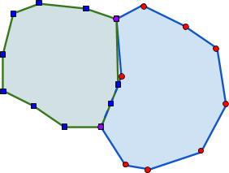|

_Figure 8: Catchment boundaries, common vertices, no gaps or overlaps_

__EC Rule 4__: Elementary catchments may be
disjoint, they may meet at a single point, or they may share a boundary
edge. This can be expressed using the DE-9IM matrix.

|Rule       |Catchment Type|Catchment Type|Description          |Valid DE-9IM          |
|-----------|------------- |--------------|---------------------|----------------------|
|EC Rule 4  |Any           |Any           |Disjoint OR Meet at a single point OR Share a boundary edge|FF\*FF\*\*\*\* OR FF\*F0\*\*\*\* OR FF\*F1\*\*\*\*|

### Elementary Flowpaths and Elementary Catchments

__EFEC Rule 1__: An elementary flowpath must
not cross the boundary of an elementary catchment.

|Rule       |Flowpath Type|Catchment Type|Description          |Valid DE-9IM          |
|-----------|-------------|--------------|---------------------|----------------------|
|EC Rule 1  |Any          |Any           |Does not cross       |NOT (T\*T\*\*\*\*\*\*)|

(Rules 2 and 3 do not apply, so they are skipped here.)

__EFEC Rule 4__: Each reach flowpath is contained in one and only one reach catchment.

|Rule       |Flowpath Type (a)|Catchment Type (b)|Description          |Valid DE-9IM          |
|-----------|-----------------|------------------|---------------------|----------------------|
|EFEC Rule 4|Reach            |Reach             |For each reach flowpath there exists one and only one reach catchment such that the catchment contains the flowpath. (b,a)|1\*\*\*\*\*FF\*|

__EFEC Rule 5__: Where a reach flowpath meets
a water catchment, it must meet at a vertex on the boundary of the
polygon representing the catchment. Other than at that endpoint, the
reach flowpath is outside of (disjoint from) the water catchment.

|Correct    |Incorrect|
|-----------|---------|
|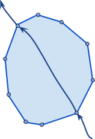||

_Figure 9: Elementary flowpath - elementary catchment shared vertex (elementary flowpaths within lake not shown)_

|Rule       |Flowpath Type|Catchment Type|Description          |Valid DE-9IM          |
|-----------|-------------|--------------|---------------------|----------------------|
|EFEC Rule 5|Reach        |Water      |Not (interior intersect)|NOT(T\*\*\*\*\*\*\*\*)|

__EFEC Rule 6__: In cases where multiple
reach flowpaths occur within a single reach catchment, all flowpaths
should form a single path (all internal nodes must have valence 2).
(Figure 10) This allows for situations where a break has occurred either
because of an attribute value change or an arbitrary subdivision. (More
typically in these situations, the elementary catchment would be
subdivided such that each elementary flowpath has a corresponding
elementary catchment, as shown on the left-hand panel.)

|Rule       |Flowpath Type (a1,a2,...)|Catchment Type (b)|Description      |Valid DE-9IM          |
|-----------|-------------------------|------------------|-----------------|----------------------|
|EFEC Rule 6|reach                    |reach             |If n (n>1) flowpaths exist in a catchment, then they form a single path|For all (a(n), b)T\*F\*\*F\*\*\* AND (An ordered set can be defined such that for(end(B(a1), start (B(a2))F*\*\*T\*\*\*\*) AND (end(B(a2), start (B(a3))F\*\*\*T\*\*\*\*) Etc.)|

|Correct    |Correct    |Correct     |Incorrect|
|-----------|-----------|------------|---------|
||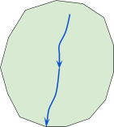|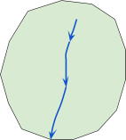|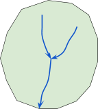|

_Figure 10: One or more elementary flowpaths in an elementary catchment_

### Working Limits and Elementary Flowpaths

__WL Rule 1__: The working limits are
specified as a series of points represented geometrically as a
multipoint. Each constituent point of the working limits multipoint
coincides exactly with the start or end vertex of one (or potentially
more than one) elementary flowpath that touches the boundary of the area
of interest. The point where they touch must be locationally equivalent
to a vertex on the boundary.

|Correct                                           |Incorrect                                             |
|--------------------------------------------------|------------------------------------------------------|
|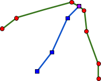|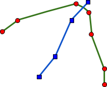|

_Figure 11: A flowpath touches the area of interest boundary at a working limits constituent point_

This rule can be represented through the DE-9IM matrix.

|Rule       |Working Limit|Flowpath Type|Description      |Valid DE-9IM          |
|-----------|-------------------------|------------------|-----------------|----------------------|
|WLEF Rule 1|For each constituent point in the multipoint|At least one elementary flowpath of any type|The point (which has an interior but no boundary) intersects the flowpath at an endpoint, which may be either the first or last vertex on the flowpath.|\*T\*\*\*\*\*\*\*|

## DEM: Physical Implementation

The Digital Elevation Model is provided in 32-bit floating point GeoTIFF
format. LZW compression is recommended. The data should be in an equal
area projection valid for the area of interest. All elevation data
should be provided in meters.

For performance reasons this TIFF image should be tiled with 1024x1024
tiles. This can be achieved using gdal\_translate with the options -co
“TILED=YES” -co “BLOCKXSIZE=1024” -co “BLOCKYSIZE=1024”.

A later version of this specification will support DEM data provided as
a point cloud. The intent would be to handle lidar data available in the
LAS format or in PostgreSQL. The software to make this practical is
currently under consideration.
